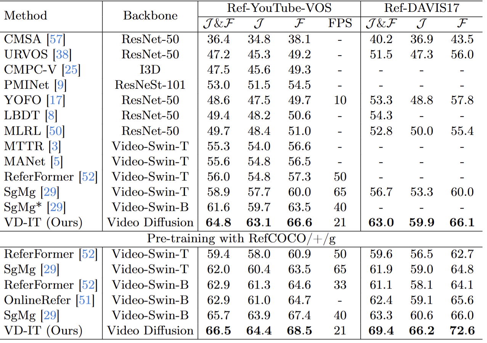
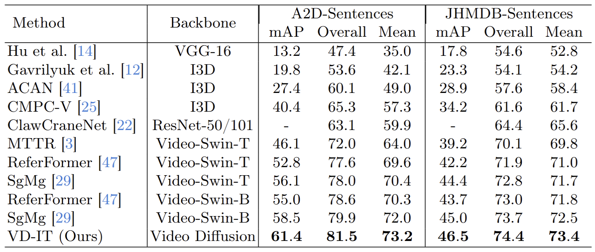

[](https://opensource.org/licenses/Apache-2.0)
[](https://pytorch.org/)

The official implementation of the **ECCV 2024** paper:

<div align="center">
<h1>
<b>
Exploring Pre-trained Text-to-Video Diffusion Models for Referring Video Object Segmentation
</b>
</h1>
</div>

<p align="center"></p>

> [**Exploring Pre-trained Text-to-Video Diffusion Models for Referring Video Object Segmentation**](https://arxiv.org/abs/2403.12042)
>
> Zixin Zhu, Xuelu Feng, Dongdong CHen, Junsong Yuan, Chunming Qiao, Gang Hua

You can find the [introduction video](https://youtu.be/da-Fs5-ZyLc).
### Abstract

  In this paper, we explore the visual representations produced from a pre-trained text-to-video (T2V) diffusion model for video understanding tasks. We hypothesize that the latent representation learned from a pretrained generative T2V model encapsulates rich semantics and coherent temporal correspondences, thereby naturally facilitating video understanding. Our hypothesis is validated through the classic referring video object segmentation (R-VOS) task. We introduce a novel framework, termed ``VD-IT'', tailored with dedicatedly designed components built upon a fixed pretrained T2V model. Specifically, VD-IT uses textual information as a conditional input, ensuring semantic consistency across time for precise temporal instance matching. It further incorporates image tokens as supplementary textual inputs, enriching the feature set to generate detailed and nuanced masks.Besides, instead of using the standard Gaussian noise, we propose to predict the video-specific noise with an extra noise prediction module, which can help preserve the feature fidelity and elevates segmentation quality. Through extensive experiments, we surprisingly observe that fixed generative T2V diffusion models, unlike commonly used video backbones (e.g., Video Swin Transformer) pretrained with discriminative image/video pre-tasks, exhibit better potential to maintain semantic alignment and temporal consistency. On existing standard benchmarks, our VD-IT achieves highly competitive results, surpassing many existing state-of-the-art methods. 


### Setup for R-VOS

The main setup for R-VOS of our code follows [Referformer](https://github.com/wjn922/ReferFormer), [SgMg](https://github.com/bo-miao/SgMg).

Please refer to [install.md](docs/install.md) for installation.

Please refer to [data.md](docs/data.md) for data preparation.

### Setup for T2V Diffusion model

The main setup for pre-trained t2v diffusion model of our code follows [Text-To-Video-Finetuning](https://github.com/ExponentialML/Text-To-Video-Finetuning).

```
cd Text-To-Video-Finetuning

git lfs install

git clone https://huggingface.co/damo-vilab/text-to-video-ms-1.7b ./mymodels/model_scope_diffusers/

pip install -r requirements.txt
```

### Training and Evaluation
You can download the pretrained model from [Google Drive](https://drive.google.com/file/d/1bRqpFmtGaHiakBnINnx67ZaBnQNy0J5C/view?usp=drive_link) and [Hugging Face](https://huggingface.co/buxiangzhiren/VD-IT/), or you can train VD-IT on your own.

The training and evaluation scripts are included in the `scripts` folder. Please run the following command:

```
sh ./scripts/dist_train_ytvos_vdit.sh
```

```
sh ./scripts/dist_test_ytvos_vdit.sh
```


### Ref-Youtube-VOS & Ref-DAVIS17
<p align="center"></p>

* denotes that we run the [official codes](https://github.com/bo-miao/SgMg) to get the results.

[//]: # (|   Dataset    | J&F | J | F |)

[//]: # (|:------------:| :----: | :----: | :----: |)

[//]: # (|  Ref-Youtube-VOS   | 64.8  | 63.1  | 66.6 | )

[//]: # (|  Ref-DAVIS17   | 63.0  | 59.9  | 66.1 | )


### A2D-Sentences & JHMDB-Sentences
<p align="center"></p>

[//]: # (| Dataset | Overall IoU | Mean IoU | mAP  |)

[//]: # (| :----: | :----: | :----: | :----: | )

[//]: # (| A2D-Sentences | 81.5 | 73.2 | 61.4 |)

[//]: # (| JHMDB-Sentences | 74.4  | 73.4 | 46.5  |)


### RefCOCO/+/g

We also support evaluate on RefCOCO/+/g validation set by using the pretrained weights (num_frames=1).


RIS (referring image segmentation):
<p align="center"></p>

[//]: # (| RefCOCO | RefCOCO+ | RefCOCOg |)

[//]: # (|:-------:|:--------:|:--------:| )

[//]: # (|  76.7   |   66.5   |   70.3   |)


## Acknowledgement

This repo is based on [ReferFormer](https://github.com/wjn922/ReferFormer) and [ModelScopeT2V](https://modelscope.cn/models/damo/text-to-video-synthesis/summary). Thanks for their wonderful works.


## Citation

```
@misc{zhu2024exploring,
      title={Exploring Pre-trained Text-to-Video Diffusion Models for Referring Video Object Segmentation}, 
      author={Zixin Zhu and Xuelu Feng and Dongdong Chen and Junsong Yuan and Chunming Qiao and Gang Hua},
      year={2024},
      eprint={2403.12042},
      archivePrefix={arXiv},
      primaryClass={cs.CV}
}
```

